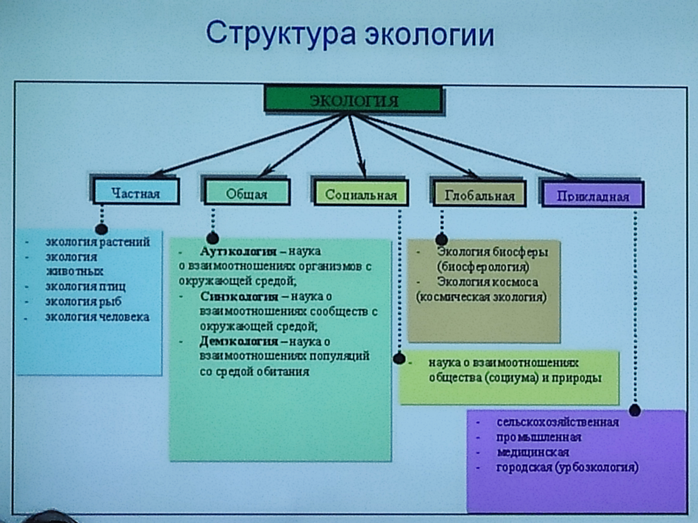

Будет 9 лабораторных работ и 9 лекций

# Экология как междиспиплинарная наука о взаимодействии живых организмов в их обществ между собой и окружающей средой

Термин экология введён **Эрнстом Геккелем** в **1866**г. \[ойкос (гр.) - дом, жилище, логос (гр.) - наука => наука о доме]

>📖 Классическое определение **экологии**:
>Наука, изучающая взаимодействие живой и неживой природы

С информационной экологией приходят новые вопросы:
- зрение (из-за сидения компьютером)
- сколиоз
- остеохондроз


Размеры "дома" могут колебаться: от небольшого ареала до природной зоны, материка и целой биосферы

"Дом" современного человека - вся планета Земля вместе с прилегающим космическим пространством


# История развития экологии

Исследования в области экологии велись ещё до введения термина в XIX веке. Изначально экология была частью таких наук, как: географии, биологии, физики

## Первый этап (... - 60-е года XIXв.)
>Зарождение и становление экологии как науки


Накапливались данные о взаимосвязи организмов со средой их обитания, делались первые научные обобщения.

Например, в трудах древнегреческих ученых рассматривались вопрос строения живых организмов, значение среды обитания в их жизни

## Труды первого этапа

### Античные времена

**Аристотель - "История Животных"** - приуроченность организмов к местам обитания, одиночная или стайная жизнь, различия в питании

**Теофраст (ученик Аристотеля, основоположник географии растений) - "География растений"** - зависимость растительного покрова от климата и почв. Он выяснил, что для того, чтобы растения росли, нужна плодородная почва, и что в зависимости от климата растения бывают разные.

### Средневековье

Развитие науки сдерживала церковь. Научные исследования были невозможны, а достижения, противоречащие содержанию Библии не принимались и придавались забвению.

Среда важных достижений были:
- очки
- микроскоп => исследования микромира

### Эпоха возрождения (XIII в. - XVI в.)

Способствовала становлению научного мировоззрения

В конце первого этапа большой вклад в формирование экологических знаний внесли эти ученые:
- Карл Линней (1707 - 1778 гг.)
- Жан Батист (1744 - 1829 гг.)
- Жорж Кювье (1769 - 1832 гг.)
- Томас Мальтус (1766 - 1834 гг.)

#### Карл Линней
Шведский естествоиспытатель. Сторонник креационистской концепции в биологии ("Разнообразие живых организмов - результат их сотворения").

Заложил основы систематики живых организмов - распределил их по группам. Предложил учёным пользоваться одинаковыми названиями для живых организмов 

#### Жан Батист Ламарк
Французский ученый, автор первого эволюционного учения. Считал, что важнейшей причиной приспособительных изменений организмов (эволюции растений и животных) является является влияние условий внешней среды

Он писал, что само живое

#### Жорж Кювье
Французский зоолог

Сформулировал теорию катастроф:
1. Творец актом творения создаёт органический мир каждой геологической эпохи заново =>
2. Органический мир существует недолго =>
3. Гибнет в результате мировой катастрофы =>
4. После чего происходит новый акт творения (возврат в начало)

Был найден компромисс между религиозным мышлением и накопленным научным материалом

**Ж.Б. Ламарк и Томас Мальтус** Предубеждают человечество о возможных негативных последствиях человека на природу.


## Второй этап (XIX в. - XX в.)
>Оформление экологии в самостоятельную отрасль знаний

Самостоятельная наука экология окончательно сформировалась в начала XX столетия. 

Крупнейший русский ученый XX века Владимир Иванович Вернадский создаёт фундаментальное учение о биосфере

>📖 Биосфера - область распространения жизни на нашей планете

В 30-х годах XX в. интенсивно развивается экспериментальная теоретическая база, углублённо изучается состав, структура, функционирование наземных и водных комплексов.


>💡 Эти исследования привели к выводу о необходимости совместного изучения биоценоза и биотопа```

#### Эрнтс Геккель
Ввёл термин "Экология" в своём труде "Всеобщая морфология организмов"

#### Чарльз Дарвин
В книге "Происхождение человека и половой отбор" (1817) выдвинул гипотезу происхождения человека:
- человек - неотъемлемая часть живой природы
- распространяет на человека основные положения эволюционной теории
- обосновал идею родства человека и обезьяны и общности их происхождения от древнего исходного предка

#### Докучаев Василий Васильевич
Русский геолог и почвовед. Основоположник национальной школы почвоведения и географии почв

Открыл соновные закономерности географического расположения почв

#### Артур Тенсли
Впервые использовал термин "Экосистема" в 1935г.

#### В. Н. Скучаев
Обосновал близке к экосистеме понятие - "**биогеноциноз**" в 1940 г.


## Третий этап (50-е года XX в. - наши дни)
>Современный этап

Связан с именами таких ученых, как Ю. Одум, Б. Небел, Н. Н. МОисеев, Н. Ф. Реймерс.

Превращение экологии в комплексную науку, включающую в себя науки об охране природной и и окружающей человека среды.

Этап связан с прогрессирующим загрязнение окружающей среды и резким усилением воздействия человека на природу.

Современная экология анализирует природные условия (факторы) существования живых организмов и изменение под влиянием разнообразных преобразующих или разрушающих воздействий.

В это этапе происходит развитие экосистемной концепции и появление необходимости перестройки экономики в соответствие с экологическими законами.

Начинают широко использоваться инструменты математического моделирования процессов, протекающих в биосфере с целью поддержания её устойчивости, а также появляется необходимость разработки инженерных решений, направленных на улучшение качества окружающей среды.


# Термины и структура экологии

>📖 Предмет экологии - изучение законов существования и развития природы, совокупности или структуры связей между организмами и средой, закономерностей реакции природы на воздействие человека, а также предельно допустимых нагрузок на природные системы, которые может позволить себе общество

>📖 Главный объект изучения - **экосистемы**, являющиеся структурными единицами биосферы

>📖 Экологическая система (экосистема) - взаимосвязанная, единая функциональная совокупность живых организмов и среды обитания

>💡 $\huge ЭКОСИСТЕМА = БИОЦЕНОЗ + БИОТОП$

Компоненты экосистемы:
- производители (продуценты)
- потребители (консументы)
- разрушители
- биогенные вещества

>📖 Биоценоз - совокупность живых организмов; включает три группы живых организмов: растения, животные, микроорганизмы

>📖 Биотоп - участок биосферы с однородными условиями существования, населённый этими организмами (или неживые компоненты среды)


# Структура экологии



>📖 Основная часть экологии - общая экология, которая изучает наиболее общие закономерности взаимоотношений организмов и среды (включая человека, как биологическое существо)

В составе экологии выделяют основные разделы:
- **Аутоэкология** - изучает взаимодействие со средой отдельных особей или видов
- **Демэкология** (популяционная экология) - изучает структуру, динамику популяций (Популяция - совокупность особей одного вида, объединяемых общей территорией и генофондом)
- **Синэкология** - изучает взаимоотношения популяций, сообществ и экосистем со средой

Экология может классифицироваться
- по конкретным объектам исследования:
	- экология растений
	- экология животных
	- экология микроорганизмов
	- экология водных организмов
- в зависимости от среды, места обитания организмов:
	- экология суши
	- экология моря
	- экология пресных вод
	- экология высокогорий
	- т.д.
- На стыке экологии с другими отраслями знаний:
	- инженерная экология
	- медицинская экология
	- космическая экология
	- т.д.
- Отдельным направлением является экология человека
